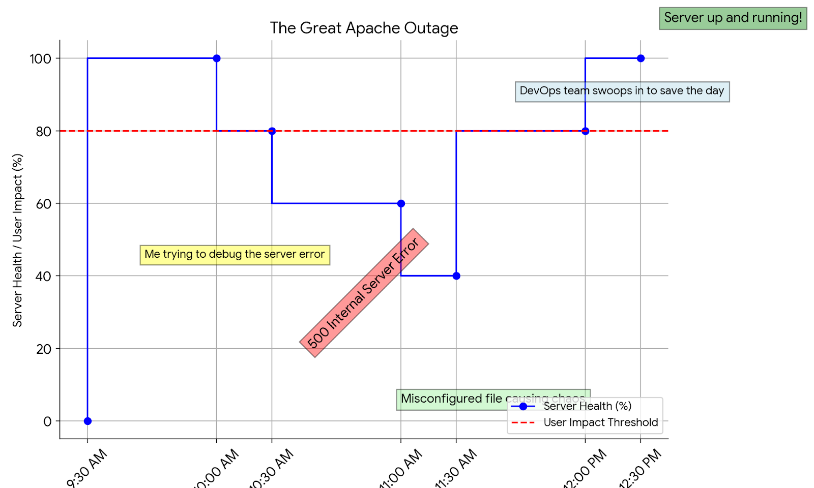

# Issue Summary

## Duration: The Apache server experienced a 2.5-hour outage, commencing at 10:00 AM UTC and concluding at 12:30 PM UTC.
## Impact: Approximately 80% of users encountered difficulties accessing websites hosted on the server due to a 500 Internal Server Error.
## Root Cause Analysis: An incorrect configuration in the Apache server settings, introduced during a recent feature deployment, was identified as the primary cause of the issue.

## Timeline:
### 10:00 AM UTC: Monitoring alerts detected an unusual surge in HTTP 500 errors, prompting initial investigation.
### 10:05 AM UTC: Engineers observed elevated CPU usage and initiated further examination.
### 10:15 AM UTC: Preliminary assumptions suggested potential resource constraints or recent software updates as possible causes.
### 10:30 AM UTC: Engineers explored multiple avenues, including software updates and resource utilization analysis.
### 11:00 AM UTC: The incident was escalated to the DevOps team for additional support.
### 11:30 AM UTC: The DevOps team pinpointed the misconfiguration in Apache server settings as the root cause.
### 12:00 PM UTC: The misconfiguration was rectified, and the Apache server was restarted.
### 12:30 PM UTC: Services were restored, and users regained access to affected websites.

## Root Cause and Resolution:
### The Apache server's misconfiguration stemmed from an error in the virtual host configuration file, specifically an incorrect definition of the WordPress classes PHP file extension (.phpp instead of .php).
### Resolution involved correcting the virtual host configuration file via a Puppet manifest and restarting Apache to apply the changes.

## Corrective and Preventative Measures:
### Improvements/Fixes:

#### Regular configuration audits to promptly detect and rectify misconfigurations
#### Thorough testing before deployment
#### Automated testing for Apache server configurations
#### Implementation of a configuration management tool (Puppet)
#### Enhanced monitoring for Apache server errors
#### Tasks to Address the Issue:
#### Implement automated configuration management
#### Establish comprehensive monitoring for Apache server errors
#### Conduct a thorough review of Apache server configurations

In conclusion, swift collaboration between engineering and DevOps teams resolved the Apache 500 Internal Server Error outage. This incident highlights the importance of regular configuration audits and proactive monitoring to ensure web service stability and reliability. By implementing automated configuration management and enhancing monitoring capabilities, similar incidents can be mitigated or prevented in the future.