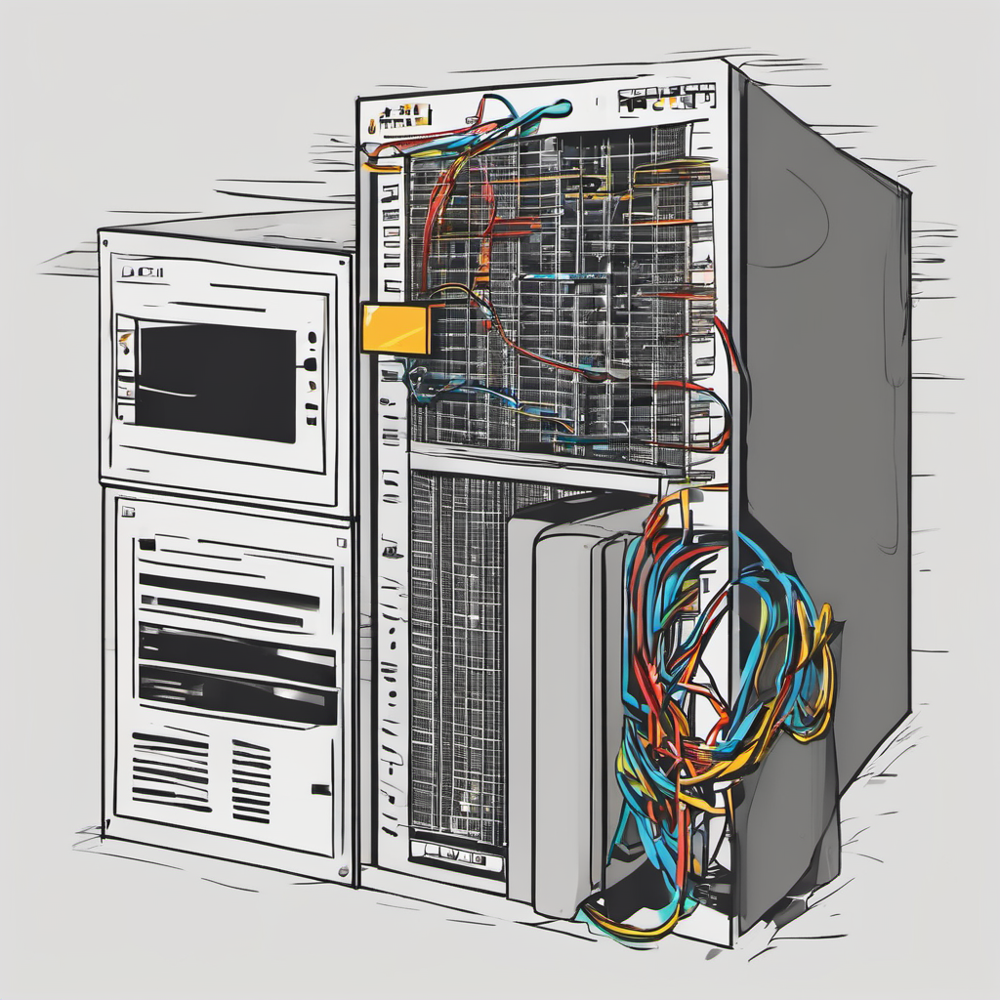

# Postmortem: Apache 500 Error Outage

## Problem Source: Web_Stack_Debugging_

### Issue Summary:

* Duration: The outage lasted from 10:00 AM to 12:30 PM UTC.
* Impact: The Apache server encountered a 500 Internal Server Error, rendering all hosted websites inaccessible. Roughly 80% of users were affected, unable to load web pages.
* Root Cause: A misconfiguration in the Apache server settings during the deployment of a new feature.

### Timeline

* 10:00 AM UTC: Detection of the issue through monitoring alerts signaling a spike in HTTP 500 errors.
* 10:05 AM UTC: Engineers observed unusually high CPU usage on the server and initiated further investigation.
* 10:15 AM UTC: Initial assumption suggested possible issues with server resources or recent software updates.
* 10:30 AM UTC: Investigations led down misleading paths, including checking recent software updates and analyzing server resource utilization.
* 11:00 AM UTC: Escalation of the incident to the DevOps team for additional support.
* 11:30 AM UTC: Identification of the misconfiguration in Apache server settings by the DevOps team as the root cause.
* 12:00 PM UTC: Correction of the misconfiguration and restart of the Apache server.
* 12:30 PM UTC: Restoration of services, allowing users to regain access to the websites hosted on the Apache server.

### Root Cause and Resolution:

* Root Cause: Misconfiguration in the Apache server settings, specifically in the virtual host configuration file (/var/www/html/wp-settings.php), incorrectly defining the WordPress classes PHP file extension as .phpp instead of .php.
* Resolution: Correction of the misconfiguration by updating the virtual host configuration file using a puppet manifest to define the file's extension correctly. Additionally, Apache was restarted to implement the changes effectively.

### Corrective and Preventative Measures:

#### Improvements/Fixes:

* Regular auditing of server configurations to promptly detect and rectify any misconfigurations, coupled with thorough testing before deployment.
* Implementation of automated testing for Apache server configurations to prevent similar issues in the future.

#### Tasks to Address the Issue:

* Implementation of a configuration management tool like Puppet to automate server configuration management.
* Establishment of more comprehensive monitoring for Apache server errors, including 500 Internal Server Errors, to proactively detect issues.
* Conduct a thorough review of all Apache server configurations to ensure consistency and accuracy.

In a nutshell, the Apache 500 Internal Server Error outage was addressed promptly through diligent investigation and collaboration between the engineering and DevOps teams. The incident underscored the significance of regular configuration auditing and proactive monitoring in maintaining the stability and reliability of web services. By implementing automated configuration management and enhancing monitoring capabilities, similar incidents can be mitigated or prevented in the future.